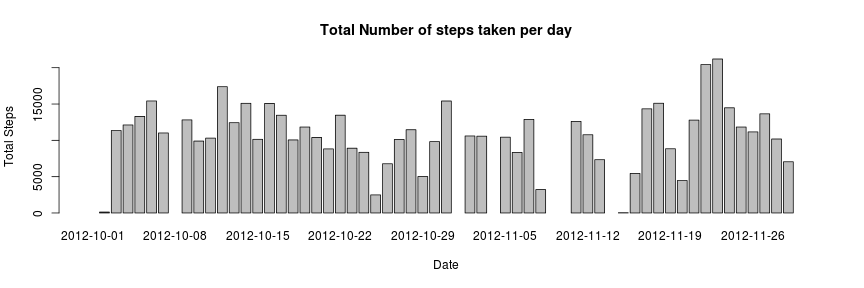
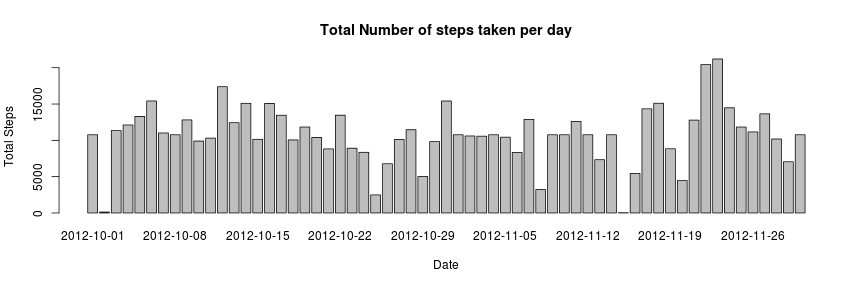
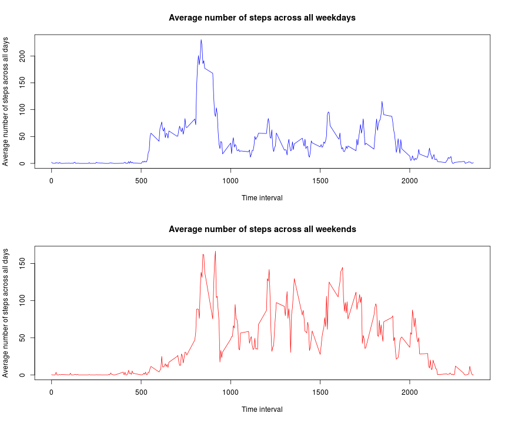

## Loading and preprocessing the data
Loading the data for personal activity of a person monitored over 2 months collected every 5 minutes. [Data Source](https://class.coursera.org/repdata-008/human_grading/view/courses/972599/assessments/3/submissions)


```r
padata <- read.csv("activity.csv")
padata[,"date"] <- as.factor(padata[,"date"])
cdata <- padata[complete.cases(padata),]
```


## What is mean total number of steps taken per day?

Create a new histogram with total number of steps taken each day


```r
totalstep <- tapply(cdata$steps, cdata$date, sum)
barplot(totalstep, names.arg=row.names(totalstep), xlab="Date", 
            ylab="Total Steps",
            main="Total Number of steps taken per day")
```

 

Calculate the mean and median of total number of steps taken per day


```r
aggvals <- data.frame(measure=c("Mean", "Median"), values=c(mean(totalstep, na.rm=TRUE), median(totalstep, na.rm=TRUE)))
print(aggvals)
```

```
##   measure   values
## 1    Mean 10766.19
## 2  Median 10765.00
```


## What is the average daily activity pattern?

Calculate the average number of steps taken across all days for 5 minute-intervals and print the time interval with the maximum average number of steps


```r
cdata$date <- as.character(cdata$date)
cdata$interval <- as.factor(cdata$interval)
meanstep <- tapply(cdata$steps, cdata$interval, mean)
meantable <- data.frame(interval=rownames(meanstep), avg=meanstep)
meantable$interval <- as.character(meantable$interval)
meantable$interval[which.max(meantable$avg)]
```

```
## [1] "835"
```

Create a time series plot of average number of steps taken across all days for 5 minute intervals


```r
plot(row.names(meanstep), meanstep, type="l", 
         ylab="Average number of steps across all days", xlab="Time interval")
```

 

## Imputing missing values

Report the number of rows with missing value of "steps"

```r
sum(is.na(padata$steps))
```

```
## [1] 2304
```

Fill the missing values with the mean value for that time interval


```r
filldata <- padata
for(i in 1:nrow(padata)){
    if (is.na(padata$steps[i])) {
        
        filldata$steps[i]<- meantable$avg[which(meantable$interval==
                                                  padata$interval[i])]
               
    }
    
}
```

Calculate the total number of steps taken each day for the new data set


```r
ftstep <- tapply(filldata$steps, filldata$date, sum)
```

Create a new histogram with total number of steps taken each day using the new data set.


```r
barplot(ftstep, names.arg=row.names(ftstep), xlab="Date", 
            ylab="Total Steps",
            main="Total Number of steps taken per day")
```

 

Calculate the mean and median of total number of steps taken per day using new data set.


```r
naggvals <- data.frame(measure=c("Mean", "Median"), values=c(mean(ftstep),
                                                             median(ftstep)))
print(naggvals)
```

```
##   measure   values
## 1    Mean 10766.19
## 2  Median 10766.19
```

## Are there differences in activity patterns between weekdays and weekends?

```r
for(i in 1:nrow(filldata)){
    if (weekdays(as.Date(filldata$date[i])) %in% c("Saturday", "Sunday"))
        filldata$wkday[i] <- "weekend"
    else
        filldata$wkday[i] <- "weekday"
}
filldata$wkday <- as.factor(filldata$wkday)
```

Calculate the average number of steps taken across all weekdays for 5 minute-intervals and across all weekends for 5 minute intervals


```r
filldata$date <- as.character(filldata$date)
filldata$interval <- as.factor(filldata$interval)
wdmeanstep <- with(filldata,tapply(steps, list("interval"=interval,
                                               "daytype"=wkday), mean))
```

Create 2 time series plots of average number of steps taken across all days for 5 minute intervals - one each for weekdays and weekends


```r
par(mfrow=c(2,1))
wdmeanstep <- as.data.frame(wdmeanstep)
plot(row.names(wdmeanstep), wdmeanstep$weekday, type="l", 
         ylab="Average number of steps across all days", xlab="Time interval",
     main="Average number of steps across all weekdays", col="blue")

plot(row.names(wdmeanstep), wdmeanstep$weekend, type="l", 
         ylab="Average number of steps across all days", xlab="Time interval",
     main="Average number of steps across all weekends", col="red")
```

 
